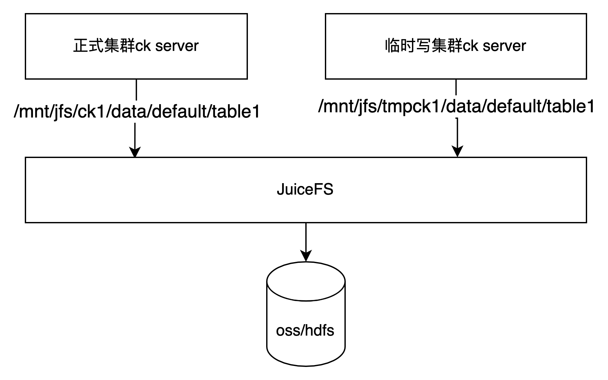

# clickhouse+JuiceFS冷热数据分层+读写分离的方案

## JuiceFS简介

juiceFS的介绍可以参考[juiceFS github](https://github.com/juicedata/juicefs)

JuiceFS 是在 GNU Affero General Public License v3.0 下发布的高性能 POSIX 文件系统。它专门针对云原生环境进行了优化。使用 JuiceFS 存储数据，数据本身会持久化到对象存储（如 S3、oss）中，数据对应的元数据可以根据需要持久化到 Redis、MySQL、SQLite 等各种数据库引擎中。

JuiceFS 可以简单方便地将海量云存储直接连接到大数据、机器学习、人工智能以及已经投入生产环境的各种应用平台，无需修改代码，您可以像使用本地存储一样高效地使用海量云存储。

<!--more-->

## 为啥会考虑使用JuiceFS

与Hadoop 生态组件通常依赖 HDFS 作为底层的数据存储不同，ClickHouse 使用本地盘来自己管理数据，[社区建议](https://clickhouse.tech/docs/en/operations/tips/#storage-subsystem)使用 SSD +raid盘的方式作为存储介质来提升性能。但受限于本地盘的容量上限以及 SSD 盘的价格，用户很难在容量、成本和性能这三者之间找到一个好的平衡。由于JuiceFS 是基于对象存储实现并完全兼容 POSIX 的开源分布式文件系统，同时 JuiceFS 的数据缓存特性可以智能管理查询热点数据，非常适合作为 ClickHouse 的存储系统，下面将详细介绍这个方案。

## 方案细节

由于JuiceFS完全兼容POSIX协议，因此可以将JuiceFS mount到本地磁盘，不同的节点可以都使用同一个JuiceFS进行mount，并使用不同的目录进行区别。

为了演示，使用hdfs作为JuiceFS的存储，使用redis作为JuiceFS的元数据存储。

### 初始化JuiceFS

```shell
juicefs  format --storage hdfs \
--bucket nn1.local.hadoop3.hy:8020,nn2.local.hadoop3.hy:8020 \
--access-key <user>@<token> \
redis://:<pwd>@<ip>:<port>/<db>  jfsck
```

### mount JuiceFS

```shell
sudo juicefs mount --cache-dir /data5/jfsCache -d redis://:<pwd>@<ip>:<port>/<db> /mnt/jfshdfs
```

### 配置clickhouse磁盘和存储策略

```
<?xml version="1.0" encoding="UTF-8"?>
<clickhouse>
    <storage_configuration>
        <disks>            
            <default>
             <keep_free_space_bytes>1048576000</keep_free_space_bytes>
            </default>
            <data2>
                <path>/data2/clickhouse/data/</path>
                <keep_free_space_bytes>1048576000</keep_free_space_bytes>
            </data2>   
            <hdfs>
                <path>/mnt/jfshdfs/68/</path>
            </hdfs>
        </disks>
        <policies>
            <default>
                <volumes>
                    <cold>
                        <disk>default</disk>
                        <disk>data2</disk>
                    </cold>            
                </volumes>
                <move_factor>0.2</move_factor>
            </default>
            <cold>
                <volumes>
                    <backup>
                        <disk>hdfs</disk>
                    </backup>
                </volumes>
            </cold>
            <hot_cold>
                <volumes>
                    <hot>
                        <disk>default</disk>
                        <disk>data2</disk>
                        <max_data_part_size_bytes>104857600</max_data_part_size_bytes>
                    </hot>
                    <cold>
                        <disk>hdfs</disk>
                    </cold>                                    
                </volumes>
                <move_factor>0.2</move_factor>
            </hot_cold>
          </policies>
    </storage_configuration>
</clickhouse>
```

配置中定义了`hot_cold`策略，该策略中包含`hot`和`cold`两个磁盘卷，`hot`中指定的是两个本地磁盘，`cold`中指定的是JuiceFS远程共享文件系统，`max_data_part_size_bytes`表示可以存储在卷的任何磁盘上的部分的最大大小。如果合并部分的大小估计大于 max_data_part_size_bytes，则该部分将被写入下一个卷。基本上，此功能允许将新/小部件保留在热 (SSD) 卷上，并在它们达到大尺寸时将它们移至冷 (HDD) 卷。为了测试这里设置为100M`move_factor`配置表示当磁盘的容量超过 80% 时触发数据移动到 JuiceFS。

重启clickhouse-server，查看存储策略是否生效


### 建表测试

#### 建表

新建一张按天分区的表，默认的存储策略设置为`hot_cold`, 设置超过20天的数据`move`到`cold`磁盘卷中

```
CREATE TABLE default.t_report_yspwl_dm_transm_mk_info2_day
(
    `day` Date DEFAULT toDate(its),
    `its` UInt32,
    `appid` Int32,
    `line` Int32,
    `user_isp` LowCardinality(String),
    `user_province` LowCardinality(String),
    `cdnip` LowCardinality(String),
    `networktype` LowCardinality(String),
    `game_name` LowCardinality(String),
    `p2p` Int32,
    `p2p_origin_type` LowCardinality(String),
    `harddecode` Int32,
    `bad_cnt` Int64,
    `log_cnt` Int64,
    `tot_log_cnt` Int64,
    `repeat_times` Int64,
    `_cnt` UInt32 DEFAULT CAST(1, 'UInt32'),
    `peak_flag` Int32
)
ENGINE = MergeTree
PARTITION BY toYYYYMMDD(day)
ORDER BY its
TTL day + toIntervalDay(20) TO VOLUME 'cold'
SETTINGS index_granularity = 8192, storage_policy = 'hot_cold'
```

#### 插入数据

1. 当插入20天前的数据，parts会直接写入到`cold`中
2. 当插入`2021-12-17`号的数据，查看parts分布


过一会等后台线程merge后再查看,可以看到17号的数据大于100MB的parts被存进了cold存储中


查看目录文件


## 一种读写分离的思路

采用JuiceFS存储clickhouse冷数据，可以有效的扩展clickhouse单节点磁盘不足的问题，同时由于JuiceFS的共享特性，可以引申出一种读写分离的架构，如下图所示。对于ck本地表`default.table1`，在离线场景下，可以从k8s上启动临时的ck server，将离线数据写入到对应表中，当分区的数据写完后，可以detach partition，然后将这个partition对应的目录move到正式集群对应的节点对应的目录中去，再在正式集群中attach进行使用。此做法在重跑大量历史数据时，可以大大减轻正式集群的节点写入压力。



## 参考

[[ClickHouse 存算分离架构探索](https://juicefs.com/blog/cn/posts/clickhouse-disaggregated-storage-and-compute-practice/)](https://juicefs.com/blog/cn/posts/clickhouse-disaggregated-storage-and-compute-practice/)

[Shopee ClickHouse 冷热数据分离存储架构与实践](https://mp.weixin.qq.com/s/eELcw0v2U9UXaHnfADj3tQ)

