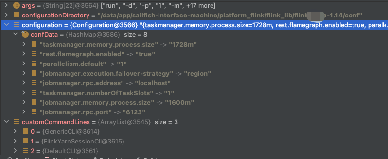
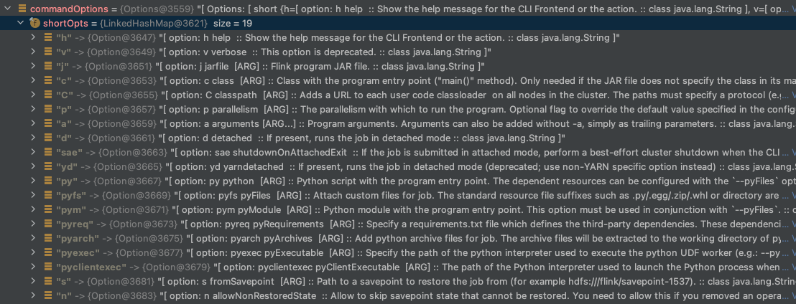
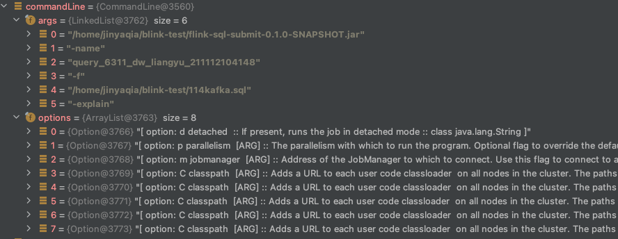
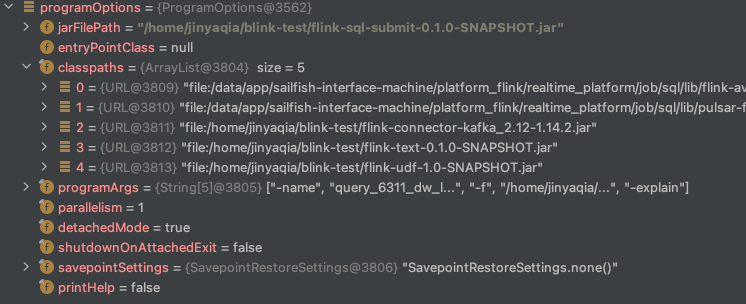
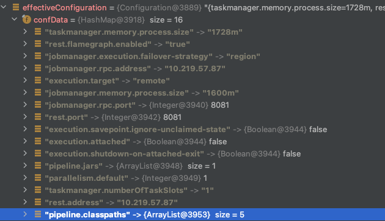
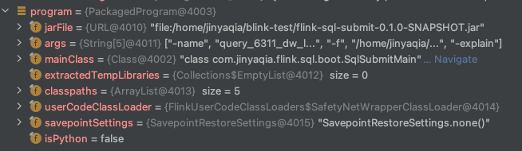

# flink作业提交源码解析（1）-命令行解析及运行

版本

```
flink: release-1.14
os: ubuntu 16.04
IDE: IDEA
```

从`bin/flink` 这个提交脚本最后一行

```shell
exec "${JAVA_RUN}" $JVM_ARGS $FLINK_ENV_JAVA_OPTS "${log_setting[@]}" -classpath "`manglePathList "$CC_CLASSPATH:$INTERNAL_HADOOP_CLASSPATHS"`" org.apache.flink.client.cli.CliFrontend "$@"
```
可以看出，入口类为`org.apache.flink.client.cli.CliFrontend`。

[开启远程调试功能](../remote-debug),在`org.apache.flink.client.cli.CliFrontend`的main函数中打断点。

<!--more-->
## 总流程

flink-client 入口: CliFrontend.java
```java
 /** Submits the job based on the arguments. */
    public static void main(final String[] args) {
        //加载环境变量，包括 code revision, current user, Java version, Hadoop version, JVM parameters
        EnvironmentInformation.logEnvironmentInfo(LOG, "Command Line Client", args);

        // 1. find the configuration directory
        final String configurationDirectory = getConfigurationDirectoryFromEnv();

        // 2. load the global configuration
        final Configuration configuration =
                GlobalConfiguration.loadConfiguration(configurationDirectory);

        // 3. load the custom command lines
        final List<CustomCommandLine> customCommandLines =
                loadCustomCommandLines(configuration, configurationDirectory);

        int retCode = 31;
        try {
            final CliFrontend cli = new CliFrontend(configuration, customCommandLines);

            SecurityUtils.install(new SecurityConfiguration(cli.configuration));
            retCode = SecurityUtils.getInstalledContext().runSecured(() -> cli.parseAndRun(args));
        } catch (Throwable t) {
            final Throwable strippedThrowable =
                    ExceptionUtils.stripException(t, UndeclaredThrowableException.class);
            LOG.error("Fatal error while running command line interface.", strippedThrowable);
            strippedThrowable.printStackTrace();
        } finally {
            System.exit(retCode);
        }
    }
```

主要分为4个步骤：

1. 加载环境变量，包括 code revision, current user, Java version, Hadoop version, JVM parameters等，然后从环境变量中获取到flink的配置目录
2. 解析配置，读取``flink-conf.yaml`，如下图所示



3. 初始化命令行解析入口，这里包含了一下三种命令行解析入口类

   ```java
   //运行bin/flink run-application xx 或者bin/flink run -t xxx的 ，
   //-t包含了"remote", "local", "kubernetes-session","yarn-per-job", "yarn-session"等模式
   org.apache.flink.client.cli.GenericCLI
   //提交到yarn session集群的命令行解析入口
   org.apache.flink.yarn.cli.FlinkYarnSessionCli
   //默认的命令行解析入口类，提交到standalone集群
   org.apache.flink.client.cli.DefaultCLI
   ```

4. 初始化`CliFrontend`,执行`cli.parseAndRun(args)`，完成flink client的主要逻辑，其中我们最需要关注的，便是`cli.parseAndRun(args)`做了些什么事情。

## 命令行解析和运行

进入`parseAndRun`函数中，可以看到程序通过解析第一个参数，来判断进入进入哪种具体的逻辑，然后把args[1:]的作为参数`params`传入具体函数里。这里我们使用第一种，即进入`run(params)`中。

```java
public int parseAndRun(String[] args) {
        // check for action
        if (args.length < 1) {
            CliFrontendParser.printHelp(customCommandLines);
            System.out.println("Please specify an action.");
            return 1;
        }
        // get action
        String action = args[0];
        // remove action from parameters
        final String[] params = Arrays.copyOfRange(args, 1, args.length);
        try {
            // do action
            switch (action) {
                case ACTION_RUN:
                    run(params);
                    return 0;
                case ACTION_RUN_APPLICATION:
                    runApplication(params);
                    return 0;
                case ACTION_LIST:
                    list(params);
                    return 0;
                case ACTION_INFO:
                    info(params);
                    return 0;
                case ACTION_CANCEL:
                    cancel(params);
                    return 0;
                case ACTION_STOP:
                    stop(params);
                    return 0;
                case ACTION_SAVEPOINT:
                    savepoint(params);
                    return 0;
   ...
```

```java
protected void run(String[] args) throws Exception {
    LOG.info("Running 'run' command.");
	//1. 获取支持的参数
    final Options commandOptions = CliFrontendParser.getRunCommandOptions();
    //2. 解析args，封装到命令行工具类里
    final CommandLine commandLine = getCommandLine(commandOptions, args, true);

    // evaluate help flag
    if (commandLine.hasOption(HELP_OPTION.getOpt())) {
        CliFrontendParser.printHelpForRun(customCommandLines);
        return;
    }

    final CustomCommandLine activeCommandLine =
            validateAndGetActiveCommandLine(checkNotNull(commandLine));
	//3. 使用解析到的commandLine去生成ProgramOptions
    final ProgramOptions programOptions = ProgramOptions.create(commandLine);
	//4. 提取作业的入口jar包
    final List<URL> jobJars = getJobJarAndDependencies(programOptions);
	//5. 提取有效的配置
    final Configuration effectiveConfiguration =
            getEffectiveConfiguration(activeCommandLine, commandLine, programOptions, jobJars);

    LOG.debug("Effective executor configuration: {}", effectiveConfiguration);
	//6. 构建PackagedProgram
    try (PackagedProgram program = getPackagedProgram(programOptions, effectiveConfiguration)) {
        //7. 执行用户jar包逻辑以及提交作业
        executeProgram(effectiveConfiguration, program);
    }
}
```

run函数包含了以下步骤

1. 获取`DefaultCLI`这个命令行解析入口类支持的参数，包含以下参数，所有的参数都封装在`org.apache.commons.cli.Options`里。



2. 解析args，将解析结果封装到命令行工具类里，如下图

```java
bin/flink run -d -p 1 -m 10.219.57.87:8081  \
-C file:/home/jinyaqia/blink-test/flink-connector-kafka_2.12-1.14.2.jar \
-C file:/home/jinyaqia/blink-test/flink-text-0.1.0-SNAPSHOT.jar \
/home/jinyaqia/blink-test/flink-sql-submit-0.1.0-SNAPSHOT.jar
-name query_6311_dw_liangyu_211112104148
-f /home/jinyaqia/blink-test/114kafka.sql
```



3. 生成`ProgramOptions`

   ```
   /** Base class for command line options that refer to a JAR file program. */
   public class ProgramOptions extends CommandLineOptions {
   	//用户入口jar包
       private String jarFilePath;
   	//用户入口类，可以用-c指定，也可以打包入口jar包的时候，指定入口类
       protected String entryPointClass;
   	//通过-C指定的classpath
       private final List<URL> classpaths;
   	//用户入口类的参数
       private final String[] programArgs;
   	//-p指定的并行度
       private final int parallelism;
   	//用-d表示detached模式,即提交作业后，退出client
       private final boolean detachedMode;
       private final boolean shutdownOnAttachedExit;
   	//savapoint设置
       private final SavepointRestoreSettings savepointSettings;
   ```

   

4. 提取作业的入口jar包

5. 提取有效的配置到`Configuration`

   

6. 构建`PackagedProgram`,该类用于描述用户提交的作业及其依赖的文件等。

```java
//包含以下属性
//用户入口jar包
private final URL jarFile;
//入口jar包的参数
private final String[] args;
//入口类
private final Class<?> mainClass;
//其他资源文件
private final List<File> extractedTempLibraries;
//-C传入的classpath
private final List<URL> classpaths;
//用户类加载器
private final URLClassLoader userCodeClassLoader;
//savepoint设置
private final SavepointRestoreSettings savepointSettings;
```



7. 执行用户jar包代码逻辑以及提交作业

   ```java
   protected void executeProgram(final Configuration configuration, final PackagedProgram program)
           throws ProgramInvocationException {
       ClientUtils.executeProgram(
               new DefaultExecutorServiceLoader(), configuration, program, false, false);
   }
   ```

   具体的执行逻辑如下：

   - 从`PackagedProgram`中获取用于加载用户代码的类加载器，这里是`ChildFirstClassLoader`，该类可以在flink-conf.yaml中配置`classloader.resolve-order`,默认为`child-first`
   - 设置当前执行线程的`classloader`为`ChildFirstClassLoader`
   - 使用当前类加载器和配置去初始化`ContextEnvironment`和`StreamContextEnvironment`，这两种`ExecutionEnvironment`在运行用户代码的时候会用到，用户代码中的 getExecutionEnvironment 会返回该 Environment
   - 运行用户代码
- 重设为原来的`classloader`，即`AppClassLoader`
  
   ```java
   //ClientUtils.java
   public static void executeProgram(
           PipelineExecutorServiceLoader executorServiceLoader,
           Configuration configuration,
           PackagedProgram program,
           boolean enforceSingleJobExecution,
           boolean suppressSysout)
           throws ProgramInvocationException {
       checkNotNull(executorServiceLoader);
       final ClassLoader userCodeClassLoader = program.getUserCodeClassLoader();
       final ClassLoader contextClassLoader = Thread.currentThread().getContextClassLoader();
       try {
           Thread.currentThread().setContextClassLoader(userCodeClassLoader);
   
           LOG.info(
                   "Starting program (detached: {})",
                   !configuration.getBoolean(DeploymentOptions.ATTACHED));
   		//用户代码中的 getExecutionEnvironment 会返回该 Environment
           ContextEnvironment.setAsContext(
                   executorServiceLoader,
                   configuration,
                   userCodeClassLoader,
                   enforceSingleJobExecution,
                   suppressSysout);
   
           StreamContextEnvironment.setAsContext(
                   executorServiceLoader,
                   configuration,
                   userCodeClassLoader,
                   enforceSingleJobExecution,
                   suppressSysout);
   
           try {
               program.invokeInteractiveModeForExecution();
           } finally {
               ContextEnvironment.unsetAsContext();
               StreamContextEnvironment.unsetAsContext();
           }
       } finally {
           Thread.currentThread().setContextClassLoader(contextClassLoader);
       }
   }
   ```

## 用户代码的运行

在运行用户代码的时候，初始化了`ContextEnvironment`和`StreamContextEnvironment`。调用`callMainMethod`方法。

```java
/**
 * This method assumes that the context environment is prepared, or the execution will be a
 * local execution by default.
 */
public void invokeInteractiveModeForExecution() throws ProgramInvocationException {
    FlinkSecurityManager.monitorUserSystemExitForCurrentThread();
    try {
        callMainMethod(mainClass, args);
    } finally {
        FlinkSecurityManager.unmonitorUserSystemExitForCurrentThread();
    }
}
```
`callMainMethod`使用了反射机制，去运行用户代码的入口类。

```java
private static void callMainMethod(Class<?> entryClass, String[] args)
        throws ProgramInvocationException {
    Method mainMethod;
    if (!Modifier.isPublic(entryClass.getModifiers())) {
        throw new ProgramInvocationException(
                "The class " + entryClass.getName() + " must be public.");
    }

    try {
        mainMethod = entryClass.getMethod("main", String[].class);
    } catch (NoSuchMethodException e) {
        throw new ProgramInvocationException(
                "The class " + entryClass.getName() + " has no main(String[]) method.");
    } catch (Throwable t) {
        throw new ProgramInvocationException(
                "Could not look up the main(String[]) method from the class "
                        + entryClass.getName()
                        + ": "
                        + t.getMessage(),
                t);
    }

    if (!Modifier.isStatic(mainMethod.getModifiers())) {
        throw new ProgramInvocationException(
                "The class " + entryClass.getName() + " declares a non-static main method.");
    }
    if (!Modifier.isPublic(mainMethod.getModifiers())) {
        throw new ProgramInvocationException(
                "The class " + entryClass.getName() + " declares a non-public main method.");
    }

    try {
        mainMethod.invoke(null, (Object) args);
    } catch (IllegalArgumentException e) {
        throw new ProgramInvocationException(
                "Could not invoke the main method, arguments are not matching.", e);
    } catch (IllegalAccessException e) {
        throw new ProgramInvocationException(
                "Access to the main method was denied: " + e.getMessage(), e);
    } catch (InvocationTargetException e) {
        Throwable exceptionInMethod = e.getTargetException();
        if (exceptionInMethod instanceof Error) {
            throw (Error) exceptionInMethod;
        } else if (exceptionInMethod instanceof ProgramParametrizationException) {
            throw (ProgramParametrizationException) exceptionInMethod;
        } else if (exceptionInMethod instanceof ProgramInvocationException) {
            throw (ProgramInvocationException) exceptionInMethod;
        } else {
            throw new ProgramInvocationException(
                    "The main method caused an error: " + exceptionInMethod.getMessage(),
                    exceptionInMethod);
        }
    } catch (Throwable t) {
        throw new ProgramInvocationException(
                "An error occurred while invoking the program's main method: " + t.getMessage(),
                t);
    }
}
```

## 参考

[Flink Client 实现原理与源码解析（保姆级教学）](https://cloud.tencent.com/developer/article/1786426)