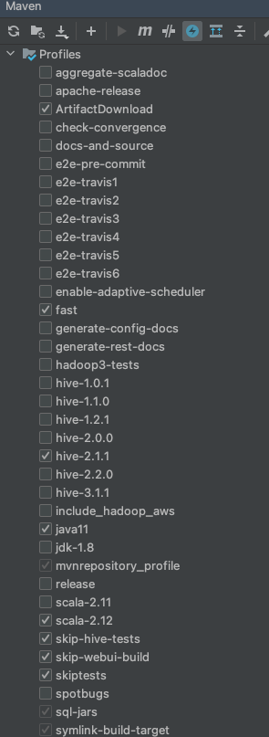
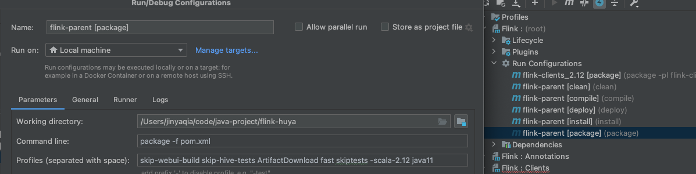
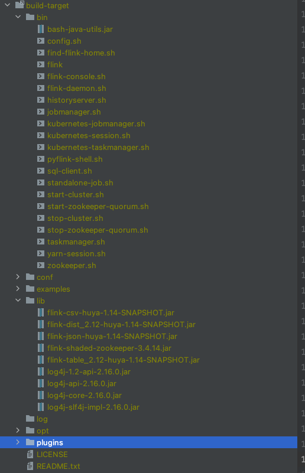
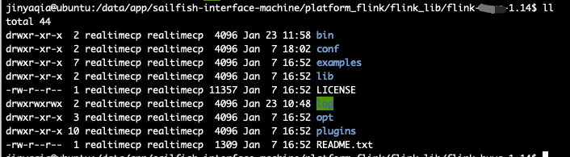
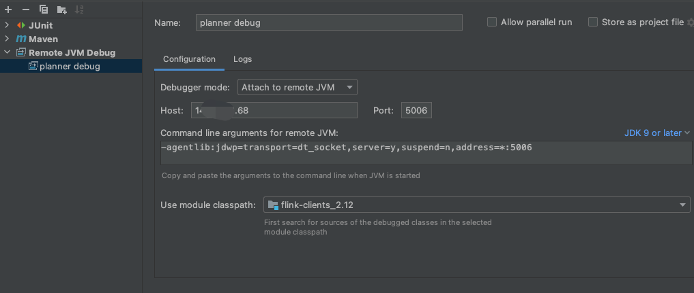

# flink远程调试

## 背景

在读flink源码的时候，如果需要了解作业运行的逻辑，除了运行单元测试之外，往往需要用到远程调试，下面就以作业提交的流程(熟悉flink client模块)来配置下远程调试的环境。

```
flink: release-1.14
os: ubuntu 16.04
IDE: IDEA
```

<!--more -->

## 下载并编译源码

首先从github上把flink源码clone下来，我这里使用的是release-1.14这个分支的代码，导入idea，在maven插件这里勾选以下的设置



在`Flink:`这个模块里的`Lifecycle`点击运行`package`，也可以手动修改`flink-parent[package]`，再运行



编译过程中可能会存在找不到包的情况，我使用的是阿里云的maven镜像仓库，本地编译完成后，编译完后的二进制包如下：



将该包打包上传到服务器上



## 启动测试集群

```shell
bin/jobmanager.sh start
bin/taskmanager.sh start
bin/taskmanager.sh start
```

## 修改作业提交脚本

修改`bin/flink`脚本：

主要是添加`JVM_REMOTE_DEBUG_ARGS`到JVM启动命令中

```shell
JVM_REMOTE_DEBUG_ARGS='-agentlib:jdwp=transport=dt_socket,server=y,suspend=y,address=*:5006'
#JVM_REMOTE_DEBUG_ARGS=''
# Add Client-specific JVM options
FLINK_ENV_JAVA_OPTS="${FLINK_ENV_JAVA_OPTS} ${FLINK_ENV_JAVA_OPTS_CLI} ${JVM_REMOTE_DEBUG_ARGS}"

# Add HADOOP_CLASSPATH to allow the usage of Hadoop file systems
exec "${JAVA_RUN}" $JVM_ARGS $FLINK_ENV_JAVA_OPTS "${log_setting[@]}" -classpath "`manglePathList "$CC_CLASSPATH:$INTERNAL_HADOOP_CLASSPATHS"`" org.apache.flink.client.cli.CliFrontend "$@"

```

## 运行调试作业

启动命令如下：

```
/data/app/sailfish-interface-machine/platform_flink/flink_lib/flink-1.14/bin/flink run -d -p 1 -m 10.219.57.87:8081  \
-C file:/home/jinyaqia/blink-test/flink-connector-kafka_2.12-1.14.2.jar \
-C file:/home/jinyaqia/blink-test/flink-text-0.1.0-SNAPSHOT.jar \
/home/jinyaqia/blink-test/flink-sql-submit-0.1.0-SNAPSHOT.jar
-name test_sql
-f /home/jinyaqia/blink-test/114kafka.sql -explain
```

其中`flink-sql-submit-0.1.0-SNAPSHOT.jar`是我的一个jar包，用于把纯sql语句解析到`TableEnvironment`，代码已经放[Github](https://github.com/jinyaqia/flink-sql-submit)上了，感兴趣可以自取。

运行完启动命令后，终端会出现

```shell
Listening for transport dt_socket at address: 5006
```

等待客户端连接

在IDEA新建一个`Remote JVM Debug`的配置，填写Host和端口号，`-agentlib:jdwp=transport=dt_socket,server=y,suspend=y,address=*:5006`就是添加到远程jvm环境的启动参数上的。

选择要调试的模块，并在代码上打断点，运行即可。



