# flink作业提交源码解析(2) - StreamGraph的生成 

## WordCount源码及执行流程概览

上文[flink作业提交源码解析(1)](flink-client.md)中说道`fink-client`中的方法`callMainMethod`使用了反射机制，去运行用户代码的入口类。本文就进一步研究用户的代码执行的逻辑。

使用自带的WordCount.jar作为例子。运行命令如下：

```java
bin/flink run -t remote -d ./examples/streaming/WordCount.jar
```
<!--more-->
wordCount的代码如下：

```java
 public static void main(String[] args) throws Exception {

        // Checking input parameters
        final MultipleParameterTool params = MultipleParameterTool.fromArgs(args);

        // set up the execution environment
        final StreamExecutionEnvironment env = StreamExecutionEnvironment.getExecutionEnvironment();

        // make parameters available in the web interface
        env.getConfig().setGlobalJobParameters(params);

        // get input data
        DataStream<String> text = null;
        if (params.has("input")) {
            // union all the inputs from text files
            for (String input : params.getMultiParameterRequired("input")) {
                if (text == null) {
                    text = env.readTextFile(input);
                } else {
                    text = text.union(env.readTextFile(input));
                }
            }
            Preconditions.checkNotNull(text, "Input DataStream should not be null.");
        } else {
            System.out.println("Executing WordCount example with default input data set.");
            System.out.println("Use --input to specify file input.");
            // get default test text data
            text = env.fromElements(WordCountData.WORDS);
        }

        DataStream<Tuple2<String, Integer>> counts =
                // split up the lines in pairs (2-tuples) containing: (word,1)
                text.flatMap(new Tokenizer())
                        // group by the tuple field "0" and sum up tuple field "1"
                        .keyBy(value -> value.f0)
                        .sum(1);

        // emit result
        if (params.has("output")) {
            counts.writeAsText(params.get("output"));
        } else {
            System.out.println("Printing result to stdout. Use --output to specify output path.");
            counts.print();
        }
        // execute program
        env.execute("Streaming WordCount");
    }
```

上面代码中，当执行`env.execute("Streaming WordCount")`,会调用具体的`ExecutionEnvironment`去提交作业，这里是`StreamExecutionEnvironment`,如下面代码所示，逻辑便是生成streamGraph，然后执行。

```java
//StreamExecutionEnvironment 
public JobExecutionResult execute(String jobName) throws Exception {
        Preconditions.checkNotNull(jobName, "Streaming Job name should not be null.");
        final StreamGraph streamGraph = getStreamGraph();
        streamGraph.setJobName(jobName);
        return execute(streamGraph);
    }
```

## 获取和生成`StreamExecutionEnvironment`

```java
final StreamExecutionEnvironment env = StreamExecutionEnvironment.getExecutionEnvironment();
```

获取一个执行环境`ExecutionEnvironment`

```java
//StreamExecutionEnvironment
/**
 * Creates an execution environment that represents the context in which the program is
 * currently executed. If the program is invoked standalone, this method returns a local
 * execution environment, as returned by {@link #createLocalEnvironment()}.
 *
 * @return The execution environment of the context in which the program is executed.
 */
public static StreamExecutionEnvironment getExecutionEnvironment() {
    return getExecutionEnvironment(new Configuration());
}
```

通过一个`StreamExecutionEnvironmentFactory`去获取，这里的`contextEnvironmentFactory`是`client`在执行用户代码前初始化好的。

```java
//StreamExecutionEnvironment

public static StreamExecutionEnvironment getExecutionEnvironment(Configuration configuration) {
    return Utils.resolveFactory(threadLocalContextEnvironmentFactory, contextEnvironmentFactory)
            .map(factory -> factory.createExecutionEnvironment(configuration))
            .orElseGet(() -> StreamExecutionEnvironment.createLocalEnvironment(configuration));
}
```

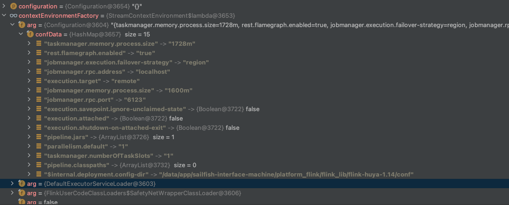

当wordCount代码执行到`env.execute("Streaming WordCount")`时，可以看到`text`这个`DataStream`，包含了`LegacySourceTransformation`

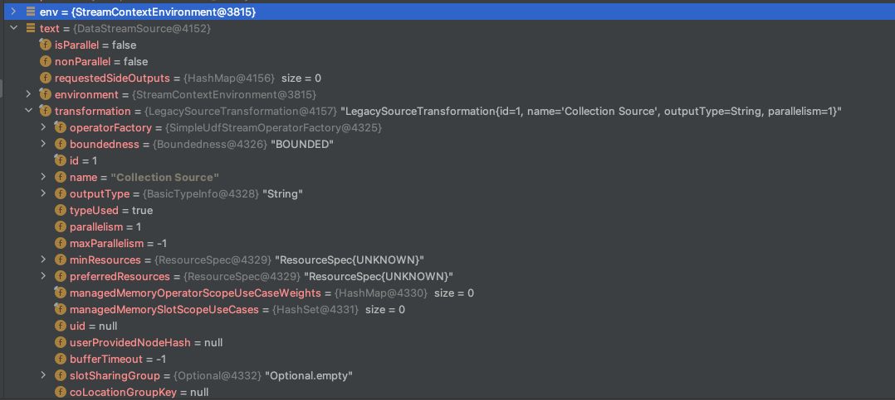

`counts`这个则包含一个`ReduceTransformation`

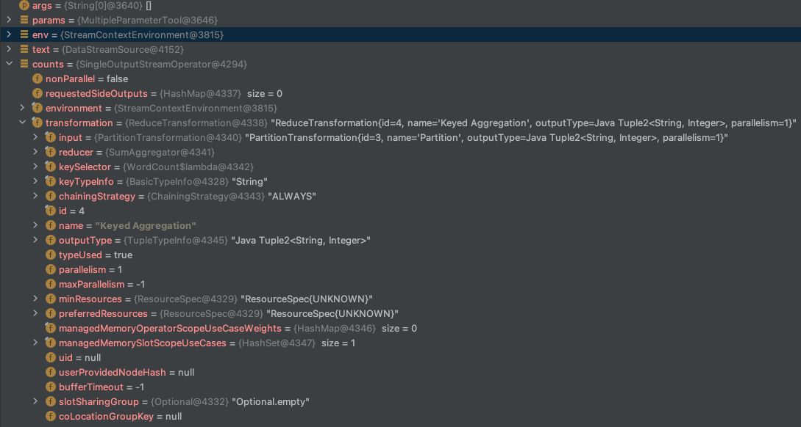

获取`StreamGraph`的逻辑在`final StreamGraph streamGraph = getStreamGraph();`这行代码的`getStreamGraph()`方法中，一步步跟进去

```java
//StreamExecutionEnvironment
@Internal
public StreamGraph getStreamGraph() {
	return getStreamGraph(true);
}
//这里执行完生成StreamGraph之后，会清空StreamExecutionEnvironment的Transformations列表
@Internal
public StreamGraph getStreamGraph(boolean clearTransformations) {
	final StreamGraph streamGraph = getStreamGraphGenerator(transformations).generate();
	if (clearTransformations) {
		transformations.clear();
	}
	return streamGraph;
}

private StreamGraphGenerator getStreamGraphGenerator(List<Transformation<?>> transformations) {
    if (transformations.size() <= 0) {
        throw new IllegalStateException(
                "No operators defined in streaming topology. Cannot execute.");
    }
    return new StreamGraphGenerator(transformations, config, checkpointCfg, configuration)
            .setStateBackend(defaultStateBackend)
            .setChangelogStateBackendEnabled(changelogStateBackendEnabled)
            .setSavepointDir(defaultSavepointDirectory)
            .setChaining(isChainingEnabled)
            .setUserArtifacts(cacheFile)
            .setTimeCharacteristic(timeCharacteristic)
            .setDefaultBufferTimeout(bufferTimeout)
            .setSlotSharingGroupResource(slotSharingGroupResources);
}
```

最终会使用`StreamGraphGenerator`这个生成器来生成`StreamGraph`, 打印需要转换的`transformations`，该作业包含了3个`Transformation`,

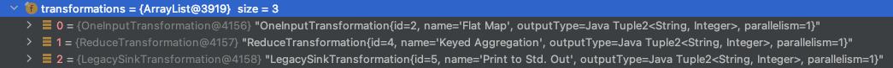

## StreamGraph生成流程总览

- 首先，在env中生成一颗Transformations树，存储在`List<Transformation<?>> transformatinos`中，如下图所示，包含了3个`Transformation`
- 其次，遍历`transformatinos`
  - `OneInputTransformation`：
    1. 获取到`input`为`LegacySourceTransformation`，生成了`Source：Collection Source`这个`StreamNode`
    2. 处理`OneInputTransformation`，生成`Flat Map`这个`StreamNode`
    3. 添加`StreamEdge`（`Source: Collection Source-1_Flat Map-2_0_FORWARD_0`）连接上游`Source：Collection Source`和`Flat Map`，由于上下游并行度一致且没有指定分区方式，所以这里分区方式是`FORWARD`
  - `RedudeTransformation`:
    1. 获取到`input`为`PartitionTransformation`，该`Transformation`不会生成`StreamNode`,只是生成一个虚拟的分区节点，记录在`StreamGraph`对象的`virtualPartitionNodes`属性中
    2. 处理`RedudeTransformation`，生成`Keyed Aggregation`这个`StreamNode`
    3. 添加`streamEdge`连接上游和自身，发现上游是虚拟分区节点，从`virtualPartitionNodes`获取到上游的`StreamNode`即`Flat Map`,生成`StreamEdge`（`Flat Map-2_Keyed Aggregation-4_0_HASH_0`）连接`Flat Map`和`Keyed Aggregation`，这里指定了分区方式为`HASH`
  - `LegacySinkTransformation`:
    1. 获取到`input`为`ReduceTransformation`，该节点已生成
    2. 处理`LegacySinkTransformation`，生成`Sink: Print to Std. Out`这个`StreamNode`
    3. 添加`StreamEdge`（`Keyed Aggregation-4_Sink: Print to Std. Out-5_0_FORWARD_0`）连接上游`Keyed Aggregation`和`Sink: Print to Std. Out`，由于上下游并行度一致且没有指定分区方式，所以这里分区方式是`FORWARD`

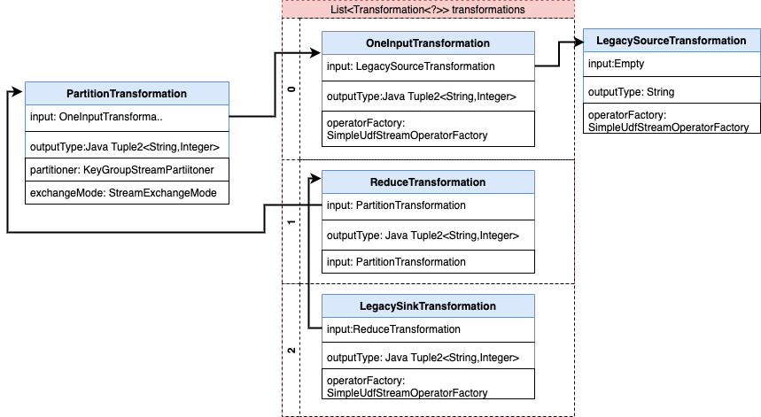


最终的streamGraph为：

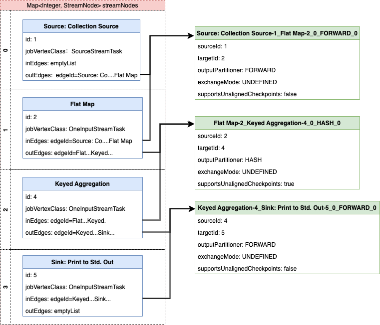

## StreamGraph生成的源码跟踪

### 主流程

主要包含几个步骤：

1. 初始化并配置`streamGraph`的信息
2.  遍历所有的`Transformation`,并对`transformation`进行转换

```java
//StreamGraphGenerator
public StreamGraph generate() {
    	//1. 初始化并配置streamGraph的信息
        streamGraph = new StreamGraph(executionConfig, checkpointConfig, savepointRestoreSettings);
        streamGraph.setEnableCheckpointsAfterTasksFinish(
                configuration.get(
                        ExecutionCheckpointingOptions.ENABLE_CHECKPOINTS_AFTER_TASKS_FINISH));
        shouldExecuteInBatchMode = shouldExecuteInBatchMode();
        configureStreamGraph(streamGraph);
		//用户保存已经转换的Transformation
        alreadyTransformed = new HashMap<>();
		//2. 对transformation进行转换
        for (Transformation<?> transformation : transformations) {
            transform(transformation);
        }
		
        streamGraph.setSlotSharingGroupResource(slotSharingGroupResources);

        setFineGrainedGlobalStreamExchangeMode(streamGraph);

        for (StreamNode node : streamGraph.getStreamNodes()) {
            if (node.getInEdges().stream().anyMatch(this::shouldDisableUnalignedCheckpointing)) {
                for (StreamEdge edge : node.getInEdges()) {
                    edge.setSupportsUnalignedCheckpoints(false);
                }
            }
        }

        final StreamGraph builtStreamGraph = streamGraph;

        alreadyTransformed.clear();
        alreadyTransformed = null;
        streamGraph = null;

        return builtStreamGraph;
    }
```

核心代码在`transform(transformation)`。

```java
//StreamGraphGenerator
private Collection<Integer> transform(Transformation<?> transform) {
	//1. 如果某个transformation已经转换过，直接返回transformedId,这里要判断，是因为graph可能会出现loop
    if (alreadyTransformed.containsKey(transform)) {
        return alreadyTransformed.get(transform);
    }

    LOG.debug("Transforming " + transform);
    //2. 设置并行度
    if (transform.getMaxParallelism() <= 0) {

        // if the max parallelism hasn't been set, then first use the job wide max parallelism
        // from the ExecutionConfig.
        int globalMaxParallelismFromConfig = executionConfig.getMaxParallelism();
        if (globalMaxParallelismFromConfig > 0) {
            transform.setMaxParallelism(globalMaxParallelismFromConfig);
        }
    }
	//3. 设置slot共享组
    transform
            .getSlotSharingGroup()
            .ifPresent(
                    slotSharingGroup -> {
                        final ResourceSpec resourceSpec =
                                SlotSharingGroupUtils.extractResourceSpec(slotSharingGroup);
                        if (!resourceSpec.equals(ResourceSpec.UNKNOWN)) {
                            slotSharingGroupResources.compute(
                                    slotSharingGroup.getName(),
                                    (name, profile) -> {
                                        if (profile == null) {
                                            return ResourceProfile.fromResourceSpec(
                                                    resourceSpec, MemorySize.ZERO);
                                        } else if (!ResourceProfile.fromResourceSpec(
                                                        resourceSpec, MemorySize.ZERO)
                                                .equals(profile)) {
                                            throw new IllegalArgumentException(
                                                    "The slot sharing group "
                                                            + slotSharingGroup.getName()
                                                            + " has been configured with two different resource spec.");
                                        } else {
                                            return profile;
                                        }
                                    });
                        }
                    });
	
    //4. 调用判断是否有推断出outputType，有则抛出异常
    transform.getOutputType();

    //5. 调用具体的translator
    @SuppressWarnings("unchecked")
    final TransformationTranslator<?, Transformation<?>> translator =
            (TransformationTranslator<?, Transformation<?>>)
                    translatorMap.get(transform.getClass());

    Collection<Integer> transformedIds;
    if (translator != null) {
        transformedIds = translate(translator, transform);
    } else {
        transformedIds = legacyTransform(transform);
    }

    // need this check because the iterate transformation adds itself before
    // transforming the feedback edges
    if (!alreadyTransformed.containsKey(transform)) {
        alreadyTransformed.put(transform, transformedIds);
    }

    return transformedIds;
}
```

步骤如下：

1. 如果某个`transformation`已经转换过，直接返回`transformedId`,这里要判断，是因为`graph`可能会出现`loop`
2. 设置并行度
3. 设置`SlotSharingGroup`
4. 调用判断是否有推断出outputType，有则抛出异常
5. 调用具体的`translator`，内置的`translator`都被保留在`translatorMap`中，具体如下所示

```java
//StreamGraphGenerator
static {
    @SuppressWarnings("rawtypes")
    Map<Class<? extends Transformation>, TransformationTranslator<?, ? extends Transformation>>
            tmp = new HashMap<>();
    tmp.put(OneInputTransformation.class, new OneInputTransformationTranslator<>());
    tmp.put(TwoInputTransformation.class, new TwoInputTransformationTranslator<>());
    tmp.put(MultipleInputTransformation.class, new MultiInputTransformationTranslator<>());
    tmp.put(KeyedMultipleInputTransformation.class, new MultiInputTransformationTranslator<>());
    tmp.put(SourceTransformation.class, new SourceTransformationTranslator<>());
    tmp.put(SinkTransformation.class, new SinkTransformationTranslator<>());
    tmp.put(LegacySinkTransformation.class, new LegacySinkTransformationTranslator<>());
    tmp.put(LegacySourceTransformation.class, new LegacySourceTransformationTranslator<>());
    tmp.put(UnionTransformation.class, new UnionTransformationTranslator<>());
    tmp.put(PartitionTransformation.class, new PartitionTransformationTranslator<>());
    tmp.put(SideOutputTransformation.class, new SideOutputTransformationTranslator<>());
    tmp.put(ReduceTransformation.class, new ReduceTransformationTranslator<>());
    tmp.put(
            TimestampsAndWatermarksTransformation.class,
            new TimestampsAndWatermarksTransformationTranslator<>());
    tmp.put(BroadcastStateTransformation.class, new BroadcastStateTransformationTranslator<>());
    tmp.put(
            KeyedBroadcastStateTransformation.class,
            new KeyedBroadcastStateTransformationTranslator<>());
    translatorMap = Collections.unmodifiableMap(tmp);
}
```

6. 将转换过的`transformation`添加到`alreadyTransformed`中

调用具体的`translator`翻译的代码逻辑如下所示

```java
//StreamGraphGenerator
private Collection<Integer> translate(
        final TransformationTranslator<?, Transformation<?>> translator,
        final Transformation<?> transform) {
    checkNotNull(translator);
    checkNotNull(transform);
	
    final List<Collection<Integer>> allInputIds = getParentInputIds(transform.getInputs());

    // the recursive call might have already transformed this
    if (alreadyTransformed.containsKey(transform)) {
        return alreadyTransformed.get(transform);
    }

    final String slotSharingGroup =
            determineSlotSharingGroup(
                    transform.getSlotSharingGroup().isPresent()
                            ? transform.getSlotSharingGroup().get().getName()
                            : null,
                    allInputIds.stream()
                            .flatMap(Collection::stream)
                            .collect(Collectors.toList()));

    final TransformationTranslator.Context context =
            new ContextImpl(this, streamGraph, slotSharingGroup, configuration);

    return shouldExecuteInBatchMode
            ? translator.translateForBatch(transform, context)
            : translator.translateForStreaming(transform, context);
}
```

下面我们针对具体的`Transformation`来进行理解。


### OneInputTransformation的转换

在进入`translate(translator, transform)`时， 首先看看`OneInputTransformation`的属性。

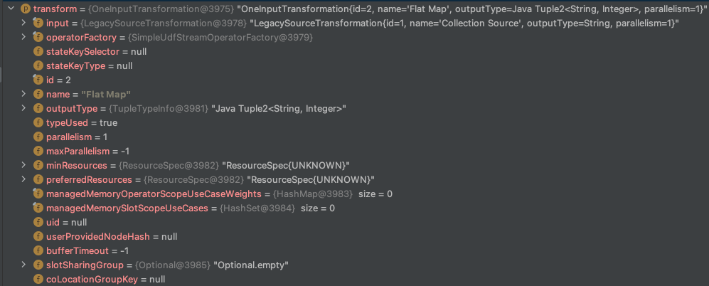

方法`getParentInputIds(transform.getInputs())`中，可以看到先对`OneInputTransformation`的输入进行转换，而它的输入为`LegacySourceTransformation`

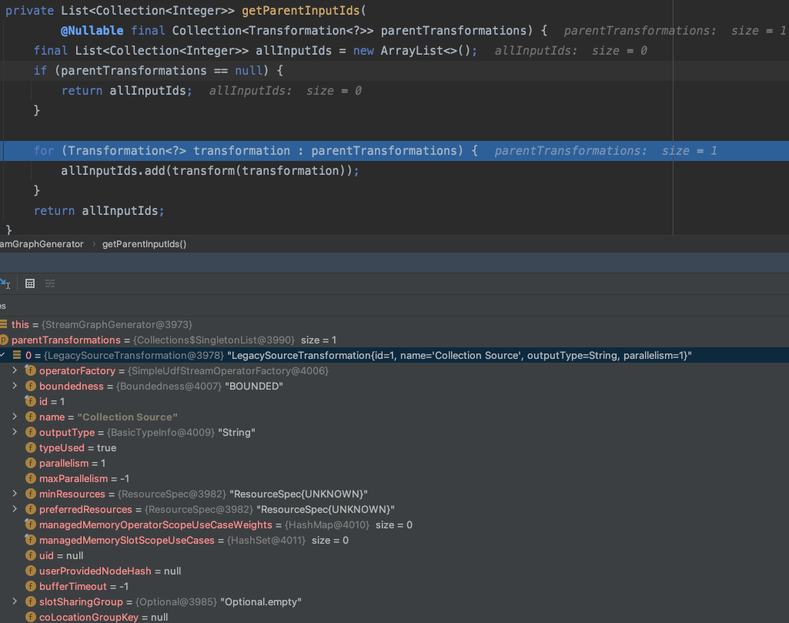

#### 设置上游input transformation——LegacySourceTransformation的转换

同样的，先对其input进行转换，由于`LegacySourceTransformation`没有input，所以对自身进行translate

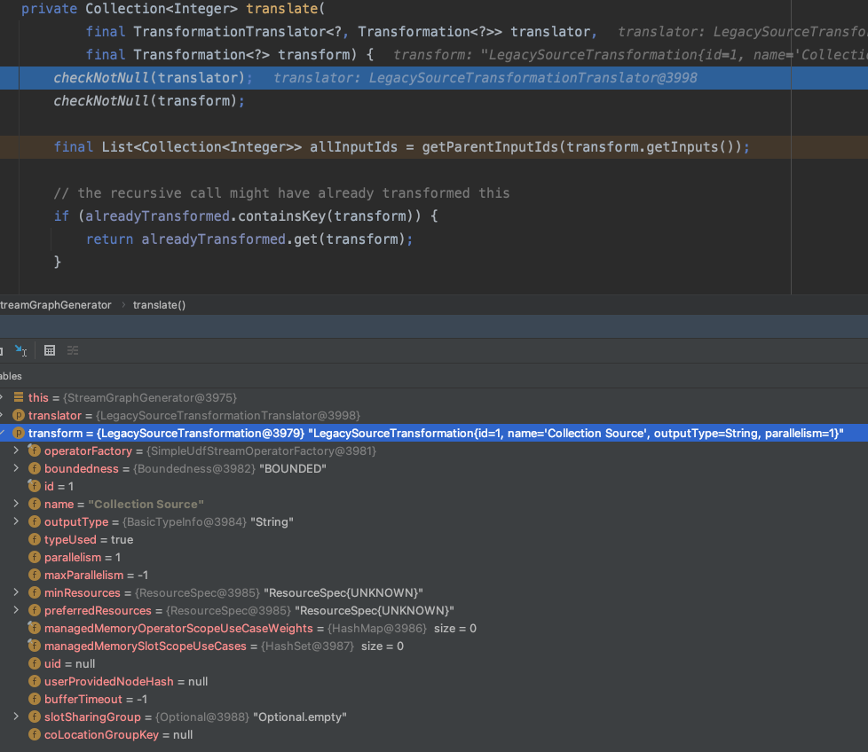

具体根据`StreamGraphGenerator`中的`shouldExecuteInBatchMode`去决定转成流还是批模式的，这里是流模式

```java
return shouldExecuteInBatchMode
        ? translator.translateForBatch(transform, context)
        : translator.translateForStreaming(transform, context);
```

```java
//SimpleTransformationTranslator
@Override
public final Collection<Integer> translateForStreaming(
        final T transformation, final Context context) {
    checkNotNull(transformation);
    checkNotNull(context);
	
    final Collection<Integer> transformedIds =
            translateForStreamingInternal(transformation, context);
    configure(transformation, context);

    return transformedIds;
}
```

这里调用了`flink-stream-java`模块里的`LegacySourceTransformationTranslator`

```java
//LegacySourceTransformationTranslator

private Collection<Integer> translateInternal(
        final LegacySourceTransformation<OUT> transformation, final Context context) {
    checkNotNull(transformation);
    checkNotNull(context);

    final StreamGraph streamGraph = context.getStreamGraph();
    final String slotSharingGroup = context.getSlotSharingGroup();
    final int transformationId = transformation.getId();
    final ExecutionConfig executionConfig = streamGraph.getExecutionConfig();

    //1. 添加source算子
    streamGraph.addLegacySource(
            transformationId,
            slotSharingGroup,
            transformation.getCoLocationGroupKey(),
            transformation.getOperatorFactory(),
            null,
            transformation.getOutputType(),
            "Source: " + transformation.getName());

    if (transformation.getOperatorFactory() instanceof InputFormatOperatorFactory) {
        streamGraph.setInputFormat(
                transformationId,
                ((InputFormatOperatorFactory<OUT>) transformation.getOperatorFactory())
                        .getInputFormat());
    }
	//设置并行度
    final int parallelism =
            transformation.getParallelism() != ExecutionConfig.PARALLELISM_DEFAULT
                    ? transformation.getParallelism()
                    : executionConfig.getParallelism();
    streamGraph.setParallelism(transformationId, parallelism);
    streamGraph.setMaxParallelism(transformationId, transformation.getMaxParallelism());

    return Collections.singleton(transformationId);
}
```

##### 添加source算子

```java
//StreamGraph
public <IN, OUT> void addLegacySource(
        Integer vertexID,
        @Nullable String slotSharingGroup,
        @Nullable String coLocationGroup,
        StreamOperatorFactory<OUT> operatorFactory,
        TypeInformation<IN> inTypeInfo,
        TypeInformation<OUT> outTypeInfo,
        String operatorName) {
    addOperator(
            vertexID,
            slotSharingGroup,
            coLocationGroup,
            operatorFactory,
            inTypeInfo,
            outTypeInfo,
            operatorName);
    sources.add(vertexID);
}

public <IN, OUT> void addOperator(
            Integer vertexID,
            @Nullable String slotSharingGroup,
            @Nullable String coLocationGroup,
            StreamOperatorFactory<OUT> operatorFactory,
            TypeInformation<IN> inTypeInfo,
            TypeInformation<OUT> outTypeInfo,
            String operatorName) {
        Class<? extends TaskInvokable> invokableClass =
                operatorFactory.isStreamSource()
                        ? SourceStreamTask.class
                        : OneInputStreamTask.class;
        addOperator(
                vertexID,
                slotSharingGroup,
                coLocationGroup,
                operatorFactory,
                inTypeInfo,
                outTypeInfo,
                operatorName,
                invokableClass);
    }

private <IN, OUT> void addOperator(
            Integer vertexID,
            @Nullable String slotSharingGroup,
            @Nullable String coLocationGroup,
            StreamOperatorFactory<OUT> operatorFactory,
            TypeInformation<IN> inTypeInfo,
            TypeInformation<OUT> outTypeInfo,
            String operatorName,
            Class<? extends TaskInvokable> invokableClass) {

    	//添加StreamNode，生成streamNode并添加进Map<Integer, StreamNode>里
        addNode(
                vertexID,
                slotSharingGroup,
                coLocationGroup,
                invokableClass,
                operatorFactory,
                operatorName);
    	//设置该transformation输入和输出的序列化方式
        setSerializers(vertexID, createSerializer(inTypeInfo), null, createSerializer(outTypeInfo));
		//设置outputType
        if (operatorFactory.isOutputTypeConfigurable() && outTypeInfo != null) {
            // sets the output type which must be know at StreamGraph creation time
            operatorFactory.setOutputType(outTypeInfo, executionConfig);
        }
		//设置inputType
        if (operatorFactory.isInputTypeConfigurable()) {
            operatorFactory.setInputType(inTypeInfo, executionConfig);
        }

        if (LOG.isDebugEnabled()) {
            LOG.debug("Vertex: {}", vertexID);
        }
    }
```

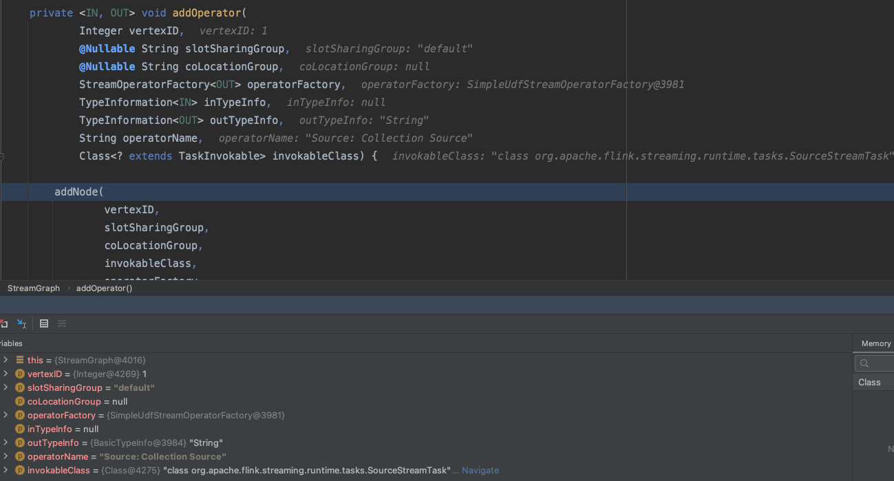

执行完`addOperator()`后：

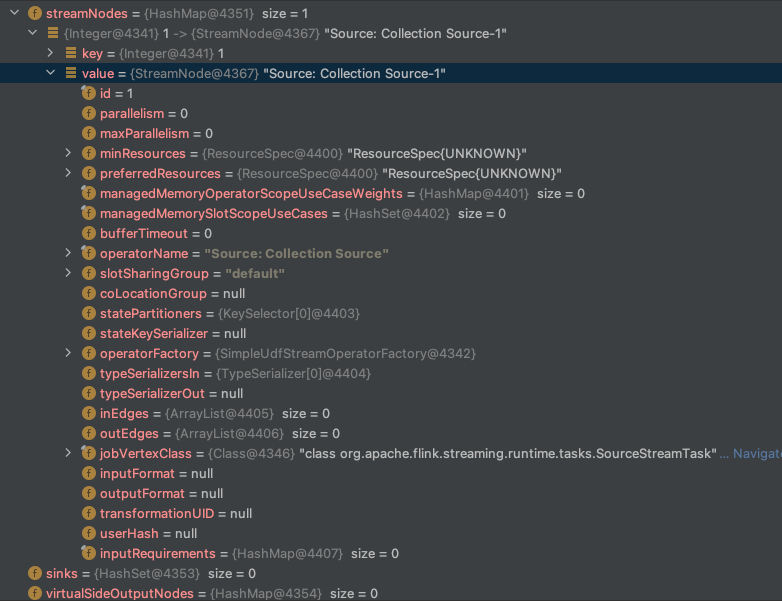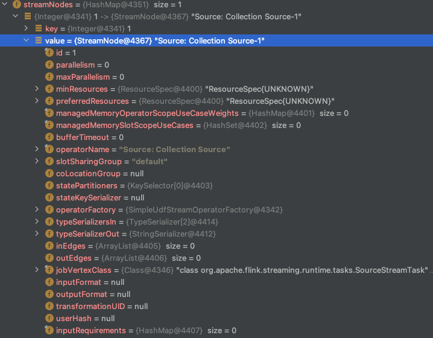

##### 设置完并行度后

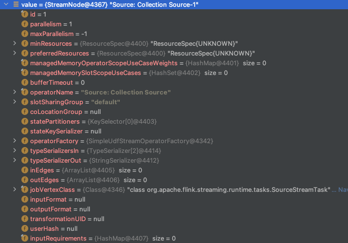

可以看到设置`parallelism=1, maxParallelism=-1`

回到`SimpleTransformationTranslator.translateForStreaming()`，下一步是`configure(transformation, context);`

##### 设置uid，用户提供的节点hash函数，资源等。

```java
private void configure(final T transformation, final Context context) {
    final StreamGraph streamGraph = context.getStreamGraph();
    final int transformationId = transformation.getId();

    StreamGraphUtils.configureBufferTimeout(
            streamGraph, transformationId, transformation, context.getDefaultBufferTimeout());
	//设置算子uid
    if (transformation.getUid() != null) {
        streamGraph.setTransformationUID(transformationId, transformation.getUid());
    }
    if (transformation.getUserProvidedNodeHash() != null) {
        streamGraph.setTransformationUserHash(
                transformationId, transformation.getUserProvidedNodeHash());
    }

    StreamGraphUtils.validateTransformationUid(streamGraph, transformation);
	//设置资源和验证
    if (transformation.getMinResources() != null
            && transformation.getPreferredResources() != null) {
        streamGraph.setResources(
                transformationId,
                transformation.getMinResources(),
                transformation.getPreferredResources());
    }

    final StreamNode streamNode = streamGraph.getStreamNode(transformationId);
    if (streamNode != null) {
        validateUseCaseWeightsNotConflict(
                streamNode.getManagedMemoryOperatorScopeUseCaseWeights(),
                transformation.getManagedMemoryOperatorScopeUseCaseWeights());
        streamNode.setManagedMemoryUseCaseWeights(
                transformation.getManagedMemoryOperatorScopeUseCaseWeights(),
                transformation.getManagedMemorySlotScopeUseCases());
    }
}
```

至此完成`LegacySourceTransformation`的转换，回到`OneInputTransformation`的转换

```java
protected Collection<Integer> translateInternal(
        final Transformation<OUT> transformation,
        final StreamOperatorFactory<OUT> operatorFactory,
        final TypeInformation<IN> inputType,
        @Nullable final KeySelector<IN, ?> stateKeySelector,
        @Nullable final TypeInformation<?> stateKeyType,
        final Context context) {
    checkNotNull(transformation);
    checkNotNull(operatorFactory);
    checkNotNull(inputType);
    checkNotNull(context);

    final StreamGraph streamGraph = context.getStreamGraph();
    final String slotSharingGroup = context.getSlotSharingGroup();
    final int transformationId = transformation.getId();
    final ExecutionConfig executionConfig = streamGraph.getExecutionConfig();
	//往streamGraph中添加算子
    streamGraph.addOperator(
            transformationId,
            slotSharingGroup,
            transformation.getCoLocationGroupKey(),
            operatorFactory,
            inputType,
            transformation.getOutputType(),
            transformation.getName());
	//设置该算子的状态key
    if (stateKeySelector != null) {
        TypeSerializer<?> keySerializer = stateKeyType.createSerializer(executionConfig);
        streamGraph.setOneInputStateKey(transformationId, stateKeySelector, keySerializer);
    }
	//设置并行度
    int parallelism =
            transformation.getParallelism() != ExecutionConfig.PARALLELISM_DEFAULT
                    ? transformation.getParallelism()
                    : executionConfig.getParallelism();
    streamGraph.setParallelism(transformationId, parallelism);
    streamGraph.setMaxParallelism(transformationId, transformation.getMaxParallelism());
	//找到父transformation
    final List<Transformation<?>> parentTransformations = transformation.getInputs();
    checkState(
            parentTransformations.size() == 1,
            "Expected exactly one input transformation but found "
                    + parentTransformations.size());
	//添加streamEdge
    for (Integer inputId : context.getStreamNodeIds(parentTransformations.get(0))) {
        streamGraph.addEdge(inputId, transformationId, 0);
    }

    return Collections.singleton(transformationId);
}
```

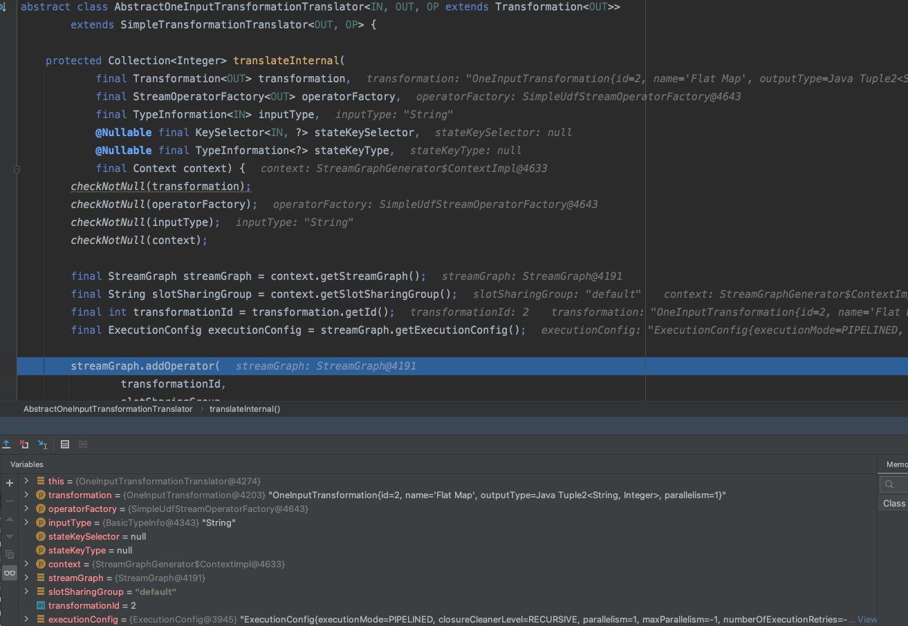

和`LegacySourceTransformation`类似，经过

- 添加`StreamNode`
- 设置该算子的状态key
- 设置并行度
- 设置uid、资源等

`streamGraph`中的`streamNode`为

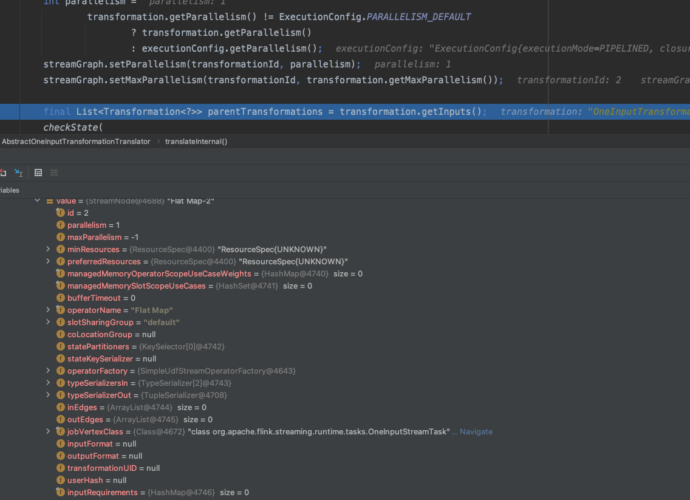

#### 添加streamEdge

```java
//StreamGraph
public void addEdge(Integer upStreamVertexID, Integer downStreamVertexID, int typeNumber) {
    addEdgeInternal(
            upStreamVertexID,
            downStreamVertexID,
            typeNumber,
            null,
            new ArrayList<String>(),
            null,
            null);
}

private void addEdgeInternal(
            Integer upStreamVertexID,
            Integer downStreamVertexID,
            int typeNumber,
            StreamPartitioner<?> partitioner,
            List<String> outputNames,
            OutputTag outputTag,
            StreamExchangeMode exchangeMode) {

        if (virtualSideOutputNodes.containsKey(upStreamVertexID)) {
            int virtualId = upStreamVertexID;
            upStreamVertexID = virtualSideOutputNodes.get(virtualId).f0;
            if (outputTag == null) {
                outputTag = virtualSideOutputNodes.get(virtualId).f1;
            }
            addEdgeInternal(
                    upStreamVertexID,
                    downStreamVertexID,
                    typeNumber,
                    partitioner,
                    null,
                    outputTag,
                    exchangeMode);
        } else if (virtualPartitionNodes.containsKey(upStreamVertexID)) {
            int virtualId = upStreamVertexID;
            upStreamVertexID = virtualPartitionNodes.get(virtualId).f0;
            if (partitioner == null) {
                partitioner = virtualPartitionNodes.get(virtualId).f1;
            }
            exchangeMode = virtualPartitionNodes.get(virtualId).f2;
            addEdgeInternal(
                    upStreamVertexID,
                    downStreamVertexID,
                    typeNumber,
                    partitioner,
                    outputNames,
                    outputTag,
                    exchangeMode);
        } else {
            //添加实际的Edge
            createActualEdge(
                    upStreamVertexID,
                    downStreamVertexID,
                    typeNumber,
                    partitioner,
                    outputTag,
                    exchangeMode);
        }
    }

private void createActualEdge(
            Integer upStreamVertexID,
            Integer downStreamVertexID,
            int typeNumber,
            StreamPartitioner<?> partitioner,
            OutputTag outputTag,
            StreamExchangeMode exchangeMode) {
        StreamNode upstreamNode = getStreamNode(upStreamVertexID);
        StreamNode downstreamNode = getStreamNode(downStreamVertexID);

        //如果没有指定分区器和上下行并行度, 操作符匹配使用forward分区策略，否则使用rebalance。
        if (partitioner == null
                && upstreamNode.getParallelism() == downstreamNode.getParallelism()) {
            partitioner = new ForwardPartitioner<Object>();
        } else if (partitioner == null) {
            partitioner = new RebalancePartitioner<Object>();
        }

        ...

        if (exchangeMode == null) {
            exchangeMode = StreamExchangeMode.UNDEFINED;
        }

        /**
         * Just make sure that {@link StreamEdge} connecting same nodes (for example as a result of
         * self unioning a {@link DataStream}) are distinct and unique. Otherwise it would be
         * difficult on the {@link StreamTask} to assign {@link RecordWriter}s to correct {@link
         * StreamEdge}.
         */
        int uniqueId = getStreamEdges(upstreamNode.getId(), downstreamNode.getId()).size();

        StreamEdge edge =
                new StreamEdge(
                        upstreamNode,
                        downstreamNode,
                        typeNumber,
                        partitioner,
                        outputTag,
                        exchangeMode,
                        uniqueId);
		//添加streamEdge到对应的streamNode中
        getStreamNode(edge.getSourceId()).addOutEdge(edge);
        getStreamNode(edge.getTargetId()).addInEdge(edge);
    }
```

以上在`LegacySourceTransformation`生成的`streamNode`和`OneInputTransformation`生成的`streamNode`中用`streamEdge`连起来。

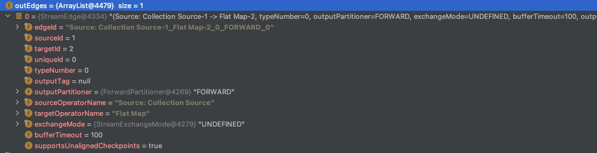

### ReduceTransformation的转换

先处理input，input为`PartitionTransformation`

#### PartitionTransformation的转换

- 找到Input
- 添加一个虚拟分区节点，不会生成 `StreamNode`，将PartitionTransformation的相关信息保存到`Map<Integer, Tuple3<Integer, StreamPartitioner<?>, StreamExchangeMode>> virtualPartitionNodes`中，`virtualPartitionNodes`的key是 虚拟分区节点的id, Tuple3中的第一个参数是input的id

```java
private Collection<Integer> translateInternal(
        final PartitionTransformation<OUT> transformation, final Context context) {
    checkNotNull(transformation);
    checkNotNull(context);

    final StreamGraph streamGraph = context.getStreamGraph();

    final List<Transformation<?>> parentTransformations = transformation.getInputs();
    checkState(
            parentTransformations.size() == 1,
            "Expected exactly one input transformation but found "
                    + parentTransformations.size());
    final Transformation<?> input = parentTransformations.get(0);

    List<Integer> resultIds = new ArrayList<>();

    for (Integer inputId : context.getStreamNodeIds(input)) {
        final int virtualId = Transformation.getNewNodeId();
        //添加一个虚拟分区节点，不会生成 StreamNode
        streamGraph.addVirtualPartitionNode(
                inputId,
                virtualId,
                transformation.getPartitioner(),
                transformation.getExchangeMode());
        resultIds.add(virtualId);
    }
    return resultIds;
}
```

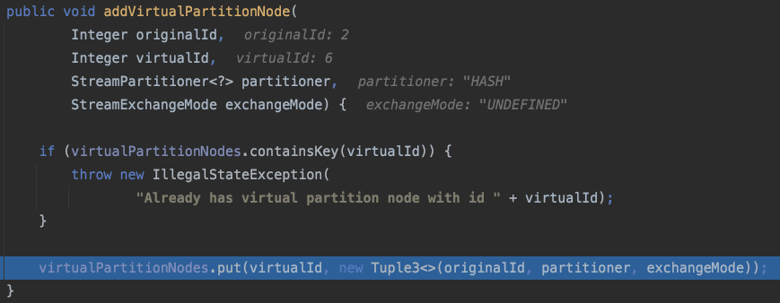

完成了`PartitionTransformation`的转换后，进入`ReduceTransformation`

```java
//ReduceTransformationTranslator

@Override
public Collection<Integer> translateForStreamingInternal(
        final ReduceTransformation<IN, KEY> transformation, final Context context) {
    StreamGroupedReduceOperator<IN> groupedReduce =
            new StreamGroupedReduceOperator<>(
                    transformation.getReducer(),
                    transformation
                            .getInputType()
                            .createSerializer(context.getStreamGraph().getExecutionConfig()));

    SimpleOperatorFactory<IN> operatorFactory = SimpleOperatorFactory.of(groupedReduce);
    operatorFactory.setChainingStrategy(transformation.getChainingStrategy());
    return translateInternal(
            transformation,
            operatorFactory,
            transformation.getInputType(),
            transformation.getKeySelector(),
            transformation.getKeyTypeInfo(),
            context);
}
```

同样的，先生成StreamNode，然后添加streamEdge。生成StreamEdge和之前的略有不同，因为`ReduceTransformation`的上游是`PartitionTransformation`，而`PartitionTransformation`是虚拟分区节点。

```java
} else if (virtualPartitionNodes.containsKey(upStreamVertexID)) {
    int virtualId = upStreamVertexID;
    upStreamVertexID = virtualPartitionNodes.get(virtualId).f0;
    if (partitioner == null) {
        partitioner = virtualPartitionNodes.get(virtualId).f1;
    }
    exchangeMode = virtualPartitionNodes.get(virtualId).f2;
    addEdgeInternal(
            upStreamVertexID,
            downStreamVertexID,
            typeNumber,
            partitioner,
            outputNames,
            outputTag,
            exchangeMode);
}
```

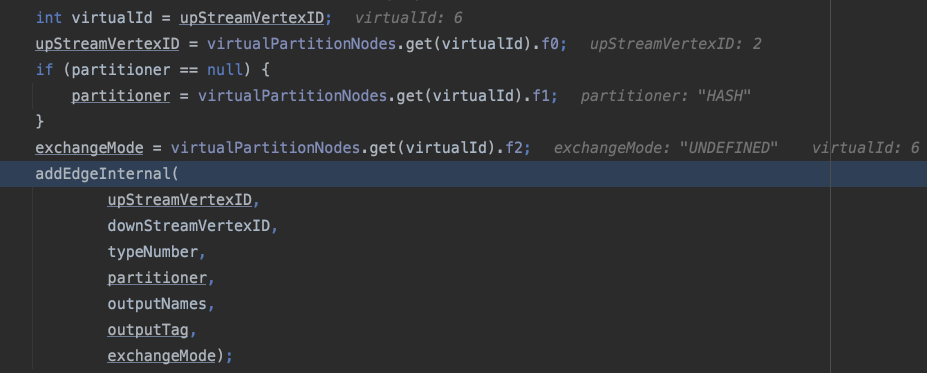

过程是这样的：

- `OneInputTransformation`生成的`StreamNode `Id=2, `PartitionTransformation`生成的虚拟分区节点(`VirtualPartitionNode`)的`virtualId=6`，`ReduceTransformation`的`StreamNode `Id=4

- 进入`ReduceTransformation`转换的`streamGraph.addEdgeInternal`方法后，发现`ReduceTransformation`的上游的id在`virtualPartitionNodes`中存在，便从`virtualPartitionNodes`拿到虚拟分区节点的上游id、`StreamPartitioner`和`StreamExchangeMode`

- 递归调用`streamGraph.addEdgeInternal`，将`outputPartitioner`和`exchangeMode`等信息保存到streamEdge中，并添加到`OneInputTransformation`生成的`StreamNode `（Flat Map-2）的`outEdges`和`ReduceTransformation`生成的`StreamNode`(Keyed Aggregation-4)的`inEdges`中。

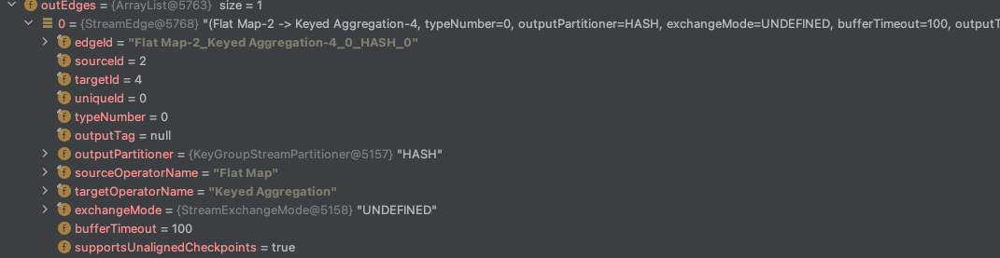

至此完成了`ReduceTransformation`的转换，其`streamNode`如下图所示。

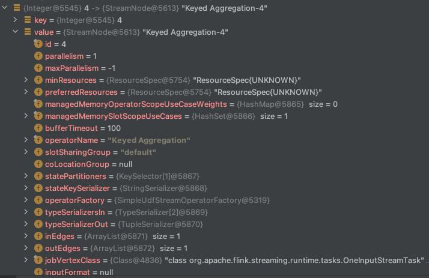

### LegacySinkTransformation的转换

流程和其他Transformation一样

```java
//LegacySinkTransformationTranslator
private Collection<Integer> translateInternal(
        final LegacySinkTransformation<IN> transformation, final Context context) {
    checkNotNull(transformation);
    checkNotNull(context);

    final StreamGraph streamGraph = context.getStreamGraph();
    final String slotSharingGroup = context.getSlotSharingGroup();
    final int transformationId = transformation.getId();
    final ExecutionConfig executionConfig = streamGraph.getExecutionConfig();

    final List<Transformation<?>> parentTransformations = transformation.getInputs();
    checkState(
            parentTransformations.size() == 1,
            "Expected exactly one input transformation but found "
                    + parentTransformations.size());
    final Transformation<?> input = parentTransformations.get(0);
	//添加sink节点
    streamGraph.addSink(
            transformationId,
            slotSharingGroup,
            transformation.getCoLocationGroupKey(),
            transformation.getOperatorFactory(),
            input.getOutputType(),
            null,
            "Sink: " + transformation.getName());

    final int parallelism =
            transformation.getParallelism() != ExecutionConfig.PARALLELISM_DEFAULT
                    ? transformation.getParallelism()
                    : executionConfig.getParallelism();
    streamGraph.setParallelism(transformationId, parallelism);
    streamGraph.setMaxParallelism(transformationId, transformation.getMaxParallelism());

    for (Integer inputId : context.getStreamNodeIds(input)) {
        streamGraph.addEdge(inputId, transformationId, 0);
    }

    if (transformation.getStateKeySelector() != null) {
        TypeSerializer<?> keySerializer =
                transformation.getStateKeyType().createSerializer(executionConfig);
        streamGraph.setOneInputStateKey(
                transformationId, transformation.getStateKeySelector(), keySerializer);
    }

    return Collections.emptyList();
}
```

```java
//StreamGraph
public <IN, OUT> void addSink(
        Integer vertexID,
        @Nullable String slotSharingGroup,
        @Nullable String coLocationGroup,
        StreamOperatorFactory<OUT> operatorFactory,
        TypeInformation<IN> inTypeInfo,
        TypeInformation<OUT> outTypeInfo,
        String operatorName) {
    addOperator(
            vertexID,
            slotSharingGroup,
            coLocationGroup,
            operatorFactory,
            inTypeInfo,
            outTypeInfo,
            operatorName);
    if (operatorFactory instanceof OutputFormatOperatorFactory) {
        setOutputFormat(
                vertexID, ((OutputFormatOperatorFactory) operatorFactory).getOutputFormat());
    }
    sinks.add(vertexID);
}
```

具体逻辑和`LegacySourceTransformation`差不多。

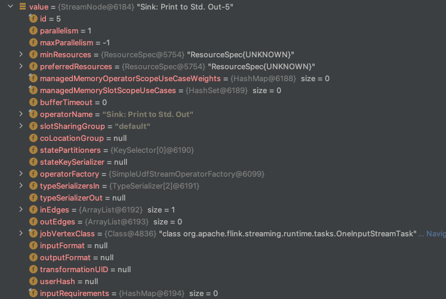

