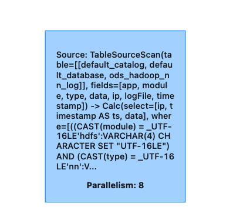
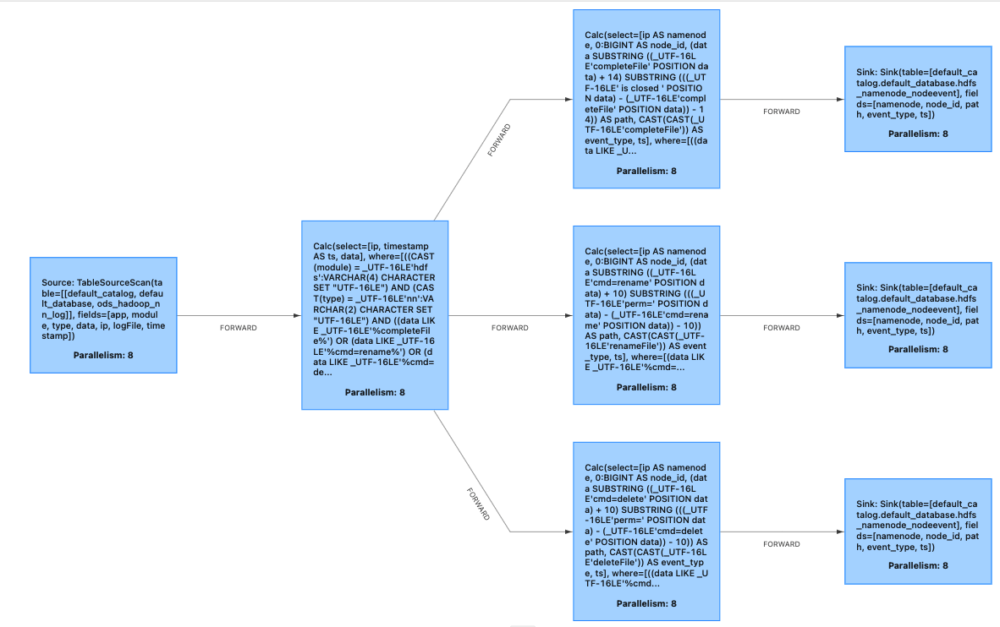
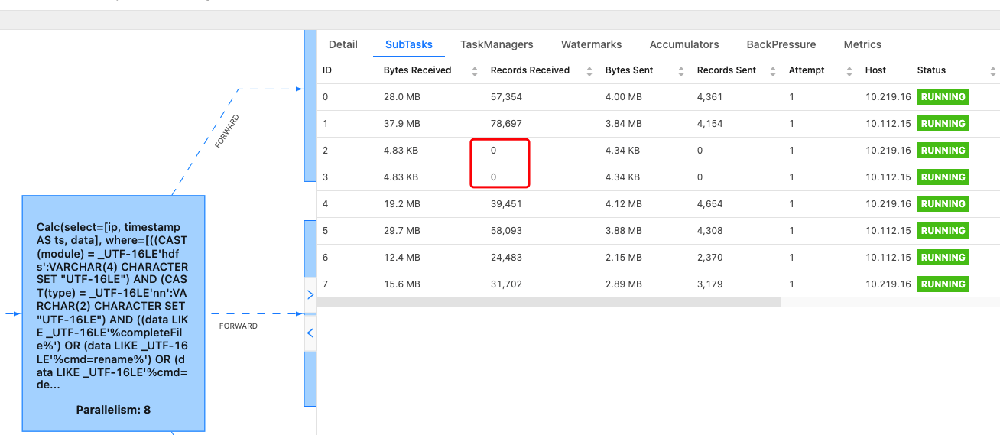
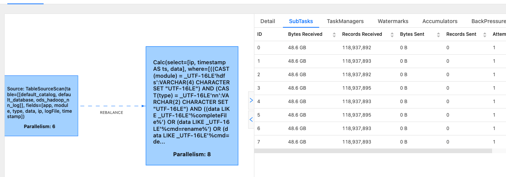

# 单独调整source并行度

当前flink 1.12版本会默认将TableSourceScan算子（从kafka/pulsar/..读取数据）和Calc（反序列化）chain在一起，以降低网络io。在一些特定场景下，比如作业并行度已经调整到和topic分区数一样后仍出现积压，此时只能通过扩topic分区，再扩flink作业并行度来提高整个作业的吞吐。当flink读取那个topic有多个消费者的时候，可能会影响其他的作业，因此比较好的做法是单独设置TableSourceScan的并行度，TableSourceScan将读取的数据rebalance/rescale到下游算子，下游算子可以设置较大的并行度。

可以通过给source table的ddl中添加 source.parallelism=<topic分区数>，调大作业并行度来进行优化。

<!-- more -->
## 优化前

针对下面的sql

```sql
create view oriData (ip,ts,data) as
select 
ip,
`timestamp` as ts,
data 
from r_dataplat.ods_hadoop_nn_log 
where `module`='hdfs' and `type`='nn' and (`data` like '%completeFile%' or `data` like '%cmd=rename%' or `data` like '%cmd=delete%');

create view parse_fileclose_rs (nn,ts,path,event_type) as
select ip nn,
ts,
SUBSTRING(data from POSITION('completeFile' in data)+CHAR_LENGTH('completeFile: ') for (POSITION(' is closed ' in data)-POSITION('completeFile' in data)-CHAR_LENGTH('completeFile: ')) ) path,
'completeFile' event_type 
from oriData a 
where `data` like '%completeFile%'
;

insert into r_dataplat.hdfs_namenode_nodeevent(namenode,node_id,path,event_type,ts)
select nn as namenode,
cast( 0 as BIGINT) node_id,
path,
event_type,
ts from
parse_fileclose_rs where POSITION('/.' in path)=0;
--去掉隐藏文件a


create view parse_filerename_rs (nn,ts,path,event_type) as
select ip nn ,
ts,
SUBSTRING(data from POSITION('cmd=rename' in data)+CHAR_LENGTH('cmd=rename') for (POSITION('perm=' in data)-POSITION('cmd=rename' in data)-CHAR_LENGTH('cmd=rename')) ) path,
'renameFile' event_type 
from oriData a 
where `data` like '%cmd=rename%'
;

insert into r_dataplat.hdfs_namenode_nodeevent(namenode,node_id,path,event_type,ts)
select nn as namenode,
cast( 0 as BIGINT) node_id,
path,
event_type,
ts from
parse_filerename_rs;
--去掉隐藏文件


create view parse_filedelete_rs (nn,ts,path,event_type) as
select ip nn,
ts,
SUBSTRING(data from POSITION('cmd=delete' in data)+CHAR_LENGTH('cmd=delete') for (POSITION('perm=' in data)-POSITION('cmd=delete' in data)-CHAR_LENGTH('cmd=delete')) ) path,
'deleteFile' event_type 
from oriData a 
where `data` like '%cmd=delete%'
;


insert into r_dataplat.hdfs_namenode_nodeevent(namenode,node_id,path,event_type,ts)
select nn as namenode,
cast( 0 as BIGINT) node_id,
path,
event_type,
ts from
parse_filedelete_rs where POSITION('/.' in path)=0;
--去掉隐藏文件

```

生成的物理执行计划如下：

```
== Physical Execution Plan ==
Stage 1 : Data Source
	content : Source: TableSourceScan(table=[[default_catalog, default_database, ods_hadoop_nn_log]], fields=[app, module, type, data, ip, logFile, timestamp])

	Stage 2 : Operator
		content : Calc(select=[ip, timestamp AS ts, data], where=[((CAST(module) = _UTF-16LE'hdfs':VARCHAR(4) CHARACTER SET "UTF-16LE") AND (CAST(type) = _UTF-16LE'nn':VARCHAR(2) CHARACTER SET "UTF-16LE") AND ((data LIKE _UTF-16LE'%completeFile%') OR (data LIKE _UTF-16LE'%cmd=rename%') OR (data LIKE _UTF-16LE'%cmd=delete%')))])
		ship_strategy : FORWARD

		Stage 3 : Operator
			content : Calc(select=[ip AS namenode, 0:BIGINT AS node_id, (data SUBSTRING ((_UTF-16LE'completeFile' POSITION data) + 14) SUBSTRING (((_UTF-16LE' is closed ' POSITION data) - (_UTF-16LE'completeFile' POSITION data)) - 14)) AS path, CAST(CAST(_UTF-16LE'completeFile')) AS event_type, ts], where=[((data LIKE _UTF-16LE'%completeFile%') AND ((_UTF-16LE'/.' POSITION (data SUBSTRING ((_UTF-16LE'completeFile' POSITION data) + 14) SUBSTRING (((_UTF-16LE' is closed ' POSITION data) - (_UTF-16LE'completeFile' POSITION data)) - 14))) = 0))])
			ship_strategy : FORWARD

			Stage 5 : Operator
				content : Calc(select=[ip AS namenode, 0:BIGINT AS node_id, (data SUBSTRING ((_UTF-16LE'cmd=rename' POSITION data) + 10) SUBSTRING (((_UTF-16LE'perm=' POSITION data) - (_UTF-16LE'cmd=rename' POSITION data)) - 10)) AS path, CAST(CAST(_UTF-16LE'renameFile')) AS event_type, ts], where=[(data LIKE _UTF-16LE'%cmd=rename%')])
				ship_strategy : FORWARD

				Stage 7 : Operator
					content : Calc(select=[ip AS namenode, 0:BIGINT AS node_id, (data SUBSTRING ((_UTF-16LE'cmd=delete' POSITION data) + 10) SUBSTRING (((_UTF-16LE'perm=' POSITION data) - (_UTF-16LE'cmd=delete' POSITION data)) - 10)) AS path, CAST(CAST(_UTF-16LE'deleteFile')) AS event_type, ts], where=[((data LIKE _UTF-16LE'%cmd=delete%') AND ((_UTF-16LE'/.' POSITION (data SUBSTRING ((_UTF-16LE'cmd=delete' POSITION data) + 10) SUBSTRING (((_UTF-16LE'perm=' POSITION data) - (_UTF-16LE'cmd=delete' POSITION data)) - 10))) = 0))])
					ship_strategy : FORWARD

					Stage 4 : Data Sink
						content : Sink: Sink(table=[default_catalog.default_database.hdfs_namenode_nodeevent], fields=[namenode, node_id, path, event_type, ts])
						ship_strategy : FORWARD

						Stage 6 : Data Sink
							content : Sink: Sink(table=[default_catalog.default_database.hdfs_namenode_nodeevent], fields=[namenode, node_id, path, event_type, ts])
							ship_strategy : FORWARD

							Stage 8 : Data Sink
								content : Sink: Sink(table=[default_catalog.default_database.hdfs_namenode_nodeevent], fields=[namenode, node_id, path, event_type, ts])
								ship_strategy : FORWARD
```




可以看到Stage 2后的ship_strategy是FORWARD，并且flink会所有算子都使用默认的并行度，就会将Stage 1和2 chain在一起，而后续都是FORWARD的数据shuffle模式, 所以所有的算子都是chain在一起的，为了更详细的观察每个算子的数据情况，设置`set pipeline.operator-chaining=false;`

jobGraph变成：





对于每个算子而言，能利用的最大并行度就等于Date Source的topic的分区数。这个就限制了程序后续处理的吞吐。

## 优化后

自定义并行度，通过在source table的语句里添加source.parallelism参数设置source算子的并行度，调大作业的默认并行度即可。

```properties
sailfish扩展的set语法，将source.parallelism添加到r_dataplat.ods_hadoop_nn_log流表的ddl中

set table.r_dataplat.ods_hadoop_nn_log.source.parallelism=6;
```

```
== Physical Execution Plan ==
Stage 1 : Data Source
	content : Source: TableSourceScan(table=[[default_catalog, default_database, ods_hadoop_nn_log]], fields=[app, module, type, data, ip, logFile, timestamp])

	Stage 2 : Operator
		content : Calc(select=[ip, timestamp AS ts, data], where=[((CAST(module) = _UTF-16LE'hdfs':VARCHAR(4) CHARACTER SET "UTF-16LE") AND (CAST(type) = _UTF-16LE'nn':VARCHAR(2) CHARACTER SET "UTF-16LE") AND ((data LIKE _UTF-16LE'%completeFile%') OR (data LIKE _UTF-16LE'%cmd=rename%') OR (data LIKE _UTF-16LE'%cmd=delete%')))])
		ship_strategy : REBALANCE

		Stage 3 : Operator
			content : Calc(select=[ip AS namenode, 0:BIGINT AS node_id, (data SUBSTRING ((_UTF-16LE'completeFile' POSITION data) + 14) SUBSTRING (((_UTF-16LE' is closed ' POSITION data) - (_UTF-16LE'completeFile' POSITION data)) - 14)) AS path, CAST(CAST(_UTF-16LE'completeFile')) AS event_type, ts], where=[((data LIKE _UTF-16LE'%completeFile%') AND ((_UTF-16LE'/.' POSITION (data SUBSTRING ((_UTF-16LE'completeFile' POSITION data) + 14) SUBSTRING (((_UTF-16LE' is closed ' POSITION data) - (_UTF-16LE'completeFile' POSITION data)) - 14))) = 0))])
			ship_strategy : FORWARD

			Stage 5 : Operator
				content : Calc(select=[ip AS namenode, 0:BIGINT AS node_id, (data SUBSTRING ((_UTF-16LE'cmd=rename' POSITION data) + 10) SUBSTRING (((_UTF-16LE'perm=' POSITION data) - (_UTF-16LE'cmd=rename' POSITION data)) - 10)) AS path, CAST(CAST(_UTF-16LE'renameFile')) AS event_type, ts], where=[(data LIKE _UTF-16LE'%cmd=rename%')])
				ship_strategy : FORWARD

				Stage 7 : Operator
					content : Calc(select=[ip AS namenode, 0:BIGINT AS node_id, (data SUBSTRING ((_UTF-16LE'cmd=delete' POSITION data) + 10) SUBSTRING (((_UTF-16LE'perm=' POSITION data) - (_UTF-16LE'cmd=delete' POSITION data)) - 10)) AS path, CAST(CAST(_UTF-16LE'deleteFile')) AS event_type, ts], where=[((data LIKE _UTF-16LE'%cmd=delete%') AND ((_UTF-16LE'/.' POSITION (data SUBSTRING ((_UTF-16LE'cmd=delete' POSITION data) + 10) SUBSTRING (((_UTF-16LE'perm=' POSITION data) - (_UTF-16LE'cmd=delete' POSITION data)) - 10))) = 0))])
					ship_strategy : FORWARD

					Stage 4 : Data Sink
						content : Sink: Sink(table=[default_catalog.default_database.hdfs_namenode_nodeevent], fields=[namenode, node_id, path, event_type, ts])
						ship_strategy : FORWARD

						Stage 6 : Data Sink
							content : Sink: Sink(table=[default_catalog.default_database.hdfs_namenode_nodeevent], fields=[namenode, node_id, path, event_type, ts])
							ship_strategy : FORWARD

							Stage 8 : Data Sink
								content : Sink: Sink(table=[default_catalog.default_database.hdfs_namenode_nodeevent], fields=[namenode, node_id, path, event_type, ts])
								ship_strategy : FORWARD
```



具体实现可以参照
[PR](https://github.com/apache/flink/pull/18277/files)